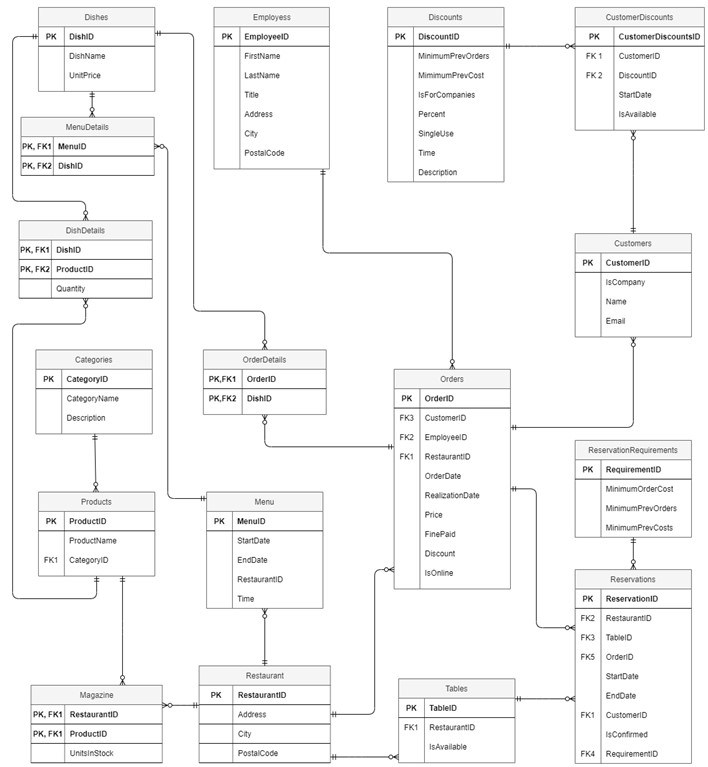
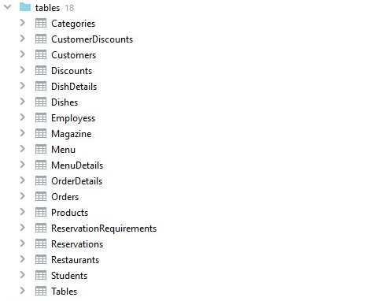
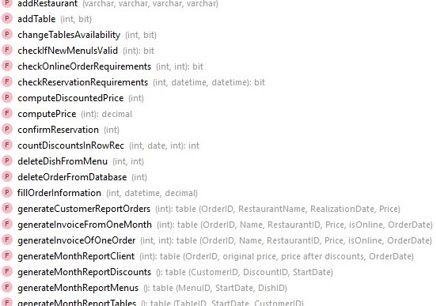
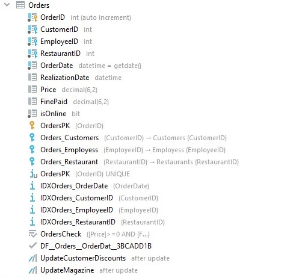

# Database

Repository contains code implemented as a part of "Basics of data bases" course at AHG UST in Cracow:

* Laboratories - was made during laboratories as a result of learning how to write all type of selects.
* DataBase - final project contains code and documentation of restaurant database.

## Technologies

* DataGrip 2020.3.2
* RedGate SQL Data Generator, and Python scripts were used to fill database with random data

----

## Final project

__Contributors__

* [Jakub Janicki](https://github.com/JanickiJ)
* [Huber Giza](https://github.com/hubertgiza)

[__Problem description__](DataBase/problem_description.pdf)

The project concerns a catering company support system for individual customers and companies.

[__Code__](Database/dataBase_Giza_Janicki.sql)

The code consist of creating tables, references, indexes, triggers, procedures, functions and triggers.

[__Documentation__](DataBase/dokumentacja_Giza_Janicki.pdf)

Consist of database diagram and full description of every database element.

__Diagram__

Was developed using [drawio](https://app.diagrams.net/).

  

__Visuals__

Shows part of database

